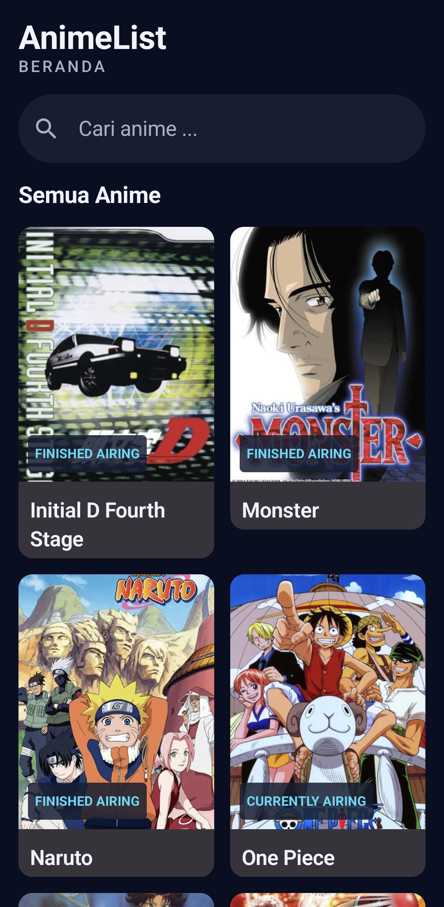
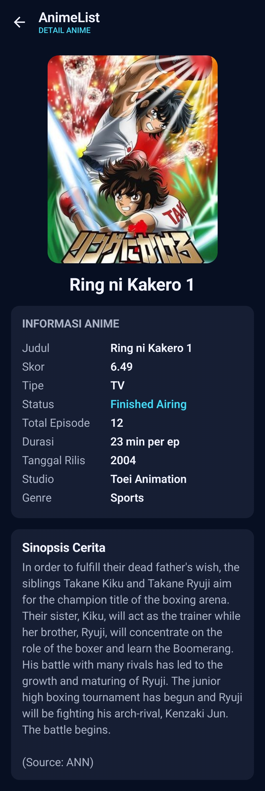

# AnimeList

AnimeList adalah aplikasi Android untuk melihat daftar anime, mencari judul, dan membaca informasi detail anime dari Tenrai API.

## Screenshot

| Halaman | Screenshot |
|---|---|
| Home Screen |  |
| Detail Screen |  |

## Penjelasan

- **Platform dan bahasa:** Android, Kotlin, dengan minimum Android 10 (API 29).
- **Antarmuka:** Jetpack Compose dan Material 3, menggunakan tema gelap.
- **Arsitektur:** MVVM dengan Repository Pattern. ViewModel mengelola state, sedangkan Repository mengambil data dari API.
- **Navigasi:** Navigation Compose menghubungkan Home Screen ke Detail Screen menggunakan ID anime.
- **Komunikasi data:** Retrofit dan Gson mengakses Tenrai API (`https://api.tenrai.org/v1/`). Coil digunakan untuk memuat poster anime.
- **Fitur:** Home Screen menampilkan daftar dalam grid dan mendukung pencarian dengan debounce. Kedua halaman menangani state loading, berhasil, dan error.

## Menjalankan Aplikasi

### Prasyarat

- Android Studio dengan dukungan Kotlin dan Jetpack Compose.
- Git.
- Emulator Android dengan API 29 atau lebih baru, atau perangkat Android 10 atau lebih baru.
- Koneksi internet untuk mengunduh dependensi Gradle dan mengambil data dari Tenrai API.

### Langkah-langkah

1. Buka Android Studio, lalu pilih **Get from VCS** pada layar awal. Jika proyek lain sedang terbuka, pilih **File > New > Project from Version Control**.
2. Pilih **Git** dan masukkan URL repository:

   ```text
   https://github.com/kmuiii/AnimeList.git
   ```

3. Tentukan folder tujuan clone, lalu klik **Clone**.
4. Setelah proyek terbuka, tunggu proses **Gradle Sync** selesai. Jika Android Studio meminta instalasi komponen SDK atau plugin yang diperlukan, setujui dan tunggu sampai selesai.
5. Pilih emulator API 29 atau lebih baru melalui **Device Manager**, atau hubungkan perangkat Android dengan USB debugging aktif.
6. Pilih konfigurasi **app**, pilih perangkat tujuan, lalu klik **Run**.
7. Pastikan perangkat terhubung ke internet agar daftar dan detail anime dapat dimuat dari API.
